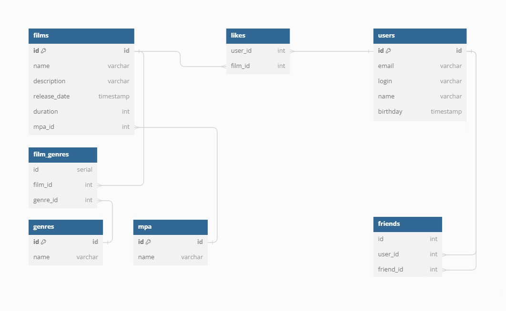

# java-filmorate
                                  Диаграмма базы данных

Получение пользователя по id

    SELECT email,
           login,
           name,
           birthday,
    FROM users
    WHERE id = ?;

Получение всех фильмов

    SELECT name,
           description,
           release_date,
           duration,
           m.mpa
    FROM films
    LEFT JOIN mpa AS m on films.mpa_id = m.mpa_id

Получение жанров фильма

    SELECT g.name
    FROM films
    LEFT JOIN film_genres AS fg on films.id = fg.film_id
    LEFT JOIN genres AS g on fg.genre_id = g.id
    WHERE films.id = ?

Список имен пользователей, которые поставили лайк фильму

    SELECT u.name
    FROM films  
    LEFT JOIN likes AS l on films.id = l.film_id
    LEFT JOIN users AS s on l.user_id = s.id
    WHERE films.id = ?

Список имен друзей пользователя

    SELECT us.name
    FROM users AS u
    RIGHT JOIN friends AS f u.id = friends.user_id
    LEFT JOIN users AS us us f.friend_id = us.id 
